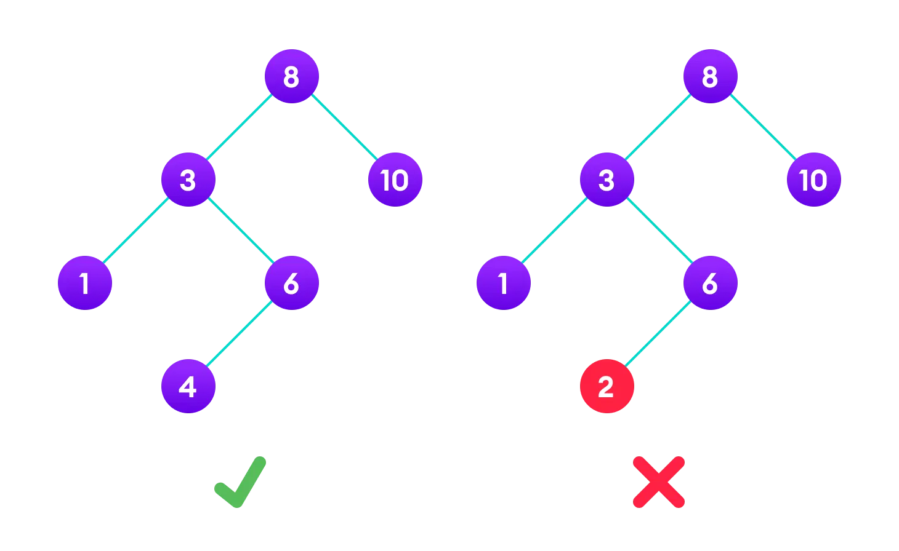

# Table Of Content

- [Apa itu Binary Tree](#binary-tree)

- [aplikasi Binary Tree](#aplikasi-binary-tree)

## Binary Search Tree

**Binary Tree** adalah salah satu dari beberapa variant tree,berbeda dengan Binary tree yang dimana aturannya hanya maksimal child node hanya 2,pada Binary Search Tree ada beberapa aturan tambahan yaitu:

- nilai node pada subtree kiri selalu lebih kecil daripada root
- nilai node pada subtree kanan selalu lebih besar daripada root

jika dilakukan traversal dan diprint,maka akan terlihat nilai node pada tree dalam urutan
ascending atau menaik.

## Aplikasi Binary Tree