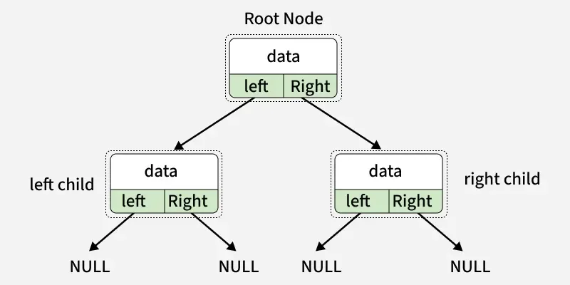

# Binary Tree Introduction

## Structure Binary Tree

masing masing node punya 2 property yaitu node left dan node right

## Property Binary Tree

- Jumlah maksimuman node pada level `l`

pada level `l` termasuk root(level 0),jumlah maksimum node adalah:

maksimum node = $2^n$

contoh:

level 0 -> maksimal 1 node(root)

level 1 -> maksimal 2 node

level 2 -> masimal 4 node

dst

## jumlah maksimum node dalam binary tree dengan tinggi h

jika tinggi(height) pohon,maka $

maks node = 1 + 2 + 4 + .. + $2^h$ = $2^{h + 1}$ - 1

misal tinggi pohon 3 maka maks node adalah $2^3+1 - 1= 15$

## Hubungan antara node internal dan leaf(daun)

dalam full binary tree,tiap node punya 0 atau 2 anak

jumlah node lead = internal node + 1

## Tinggi minimum dan Tinggi maksimum

- Tinggi minimum terjadi kalau pohon penuh (complete/full) → seimbang.

- Tinggi maksimum terjadi kalau pohon seperti linked list (setiap node cuma punya satu anak).

## Jenis Binary Tree Berdasarkan Property

- Full Binary Tree → setiap node punya 0 atau 2 anak.

- Complete Binary Tree → semua level terisi penuh, kecuali level terakhir yang terisi dari kiri ke kanan.

- Perfect Binary Tree → semua level terisi penuh dan semua daun di level yang sama.

- Degenerate (Skewed) Tree → setiap node hanya punya satu anak (kiri saja atau kanan saja).

