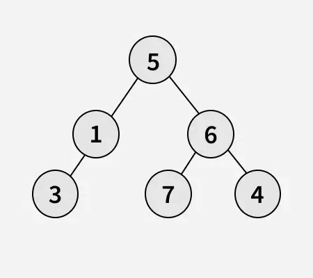

# Daftar Isi

- [struktur Binary Tree](#structure-binary-tree)
- [traversal](#traversal)   
    - [dfs](#deepth-first)
    - [bfs](#breadth-first)
- [problem](#problem)

## Structure Binary Tree

masing masing node punya 2 property yaitu node left dan node right

## Property Binary Tree

- Jumlah maksimuman node pada level `l`

pada level `l` termasuk root(level 0),jumlah maksimum node adalah:

maksimum node = $2^n$

contoh:

level 0 -> maksimal 1 node(root)

level 1 -> maksimal 2 node

level 2 -> masimal 4 node

dst

## jumlah maksimum node dalam binary tree dengan tinggi h

jika tinggi(height) pohon,maka $

maks node = 1 + 2 + 4 + .. + $2^h$ = $2^{h + 1}$ - 1

misal tinggi pohon 3 maka maks node adalah $2^3+1 - 1= 15$

## Hubungan antara node internal dan leaf(daun)

dalam full binary tree,tiap node punya 0 atau 2 anak

jumlah node lead = internal node + 1

## Tinggi minimum dan Tinggi maksimum

- Tinggi minimum terjadi kalau pohon penuh (complete/full) → seimbang.

- Tinggi maksimum terjadi kalau pohon seperti linked list (setiap node cuma punya satu anak).

## Jenis Binary Tree Berdasarkan Property

- Full Binary Tree → setiap node punya 0 atau 2 anak.

- Complete Binary Tree → semua level terisi penuh, kecuali level terakhir yang terisi dari kiri ke kanan.

- Perfect Binary Tree → semua level terisi penuh dan semua daun di level yang sama.

- Degenerate (Skewed) Tree → setiap node hanya punya satu anak (kiri saja atau kanan saja).

## Traversal

Tree memiliki 2 jenis traversal yaitu:

### Deepth first

[Deepth first](../Binary_Tree/traversal/deep_first) atau biasa dikenal Deepth first traversal(dfs) adalah jenis traversal yang menelusuri subtree paling kiri dan terdalam terlebih dahulu lalu pindah ke subtree kanan.deepth
first biasanya memakai rekursif untuk melakukan traversal tetapi dapat juga memakai iteratif approach

dfs memiliki 3 metode yaitu 

- inorder

    inorder menelusuri node mulai dari subtree kiri sampai pada leaf paling kiri lalu kembali ke root setelah itu mulai menelusuri node pada subtree paling kanan.Maka urutan dari inorder traversal adalah:

    subtreee kiri -> root -> subtree kanan

- preorder

    preorder menelusuri node mulai dari root lalu ke subtree kiri hingga ke leaf node paling kiri,setelah
    itu menelusuri subtree kanan.Maka urutan dari preorder traversal adalah:
    
    root -> subtree kiri ->subtree kanan

- postorder
    postorder menelusuri node mulai dari subtree paling kiri hingga leaf node paling kiri setelah itu pindah ke
    subtree paling kanan sampai leaf node paling kanan setelah itu kembali ke root.Maka urutan dari postorder
    traversal sebagai adalah:
    
    subtree kiri ->subtree kanan -> root

### breadth first
[Breadh first](Binary_Tree/traversal/breadth_first) atau biasa dikenal `breadth first traversal(bfs)` adalah jenis traversal yang menelusi node.dengan cara melebar dari kiri ke kanan sampai leaf kanan.selain itu breadth first juga dikenal dengan nama `level order traversal`,karena kita dapat memproses node per level

## Problem

1. size of tree

diberikan binary tree hitung size pada tree.size adalah `banyak node` yang ada pada tree

contoh:

output: `6`

penjelasan: banyak node yang ada pada tree berjumlah `6`

**solusi**

- dari jenis traversal pilih salah satu
- buat counter untuk menghitung banyak node.
- lakukan traversal tiap kemunculan node increment counter

solusi dapat dilihat di [sini](../Binary_Tree/problems/Size_of_a_tree.cpp)