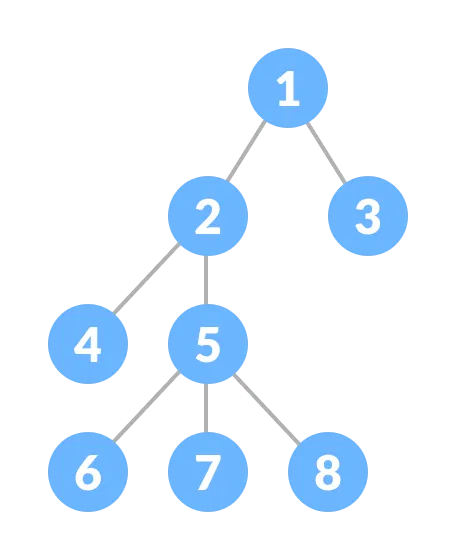
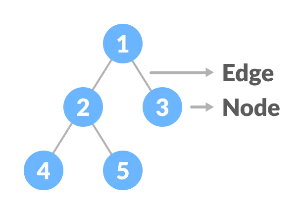
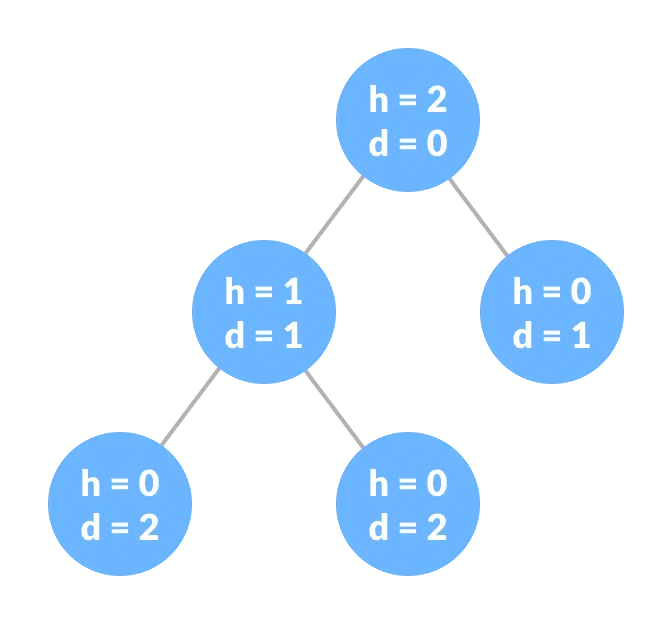

# Tree Introduction

## Basic Terminology in Tree Data Structure



misal kita punya struktur tree seperti digambar diatas,maka kita dapat mengenal lebih jauh
terminology didalam tree.

- Node

dalam struktur data tree,`node(simpul)` adalah elemen dasar atau unit utama yang membentuk seluruh pohon 

- edge

edge adalah pengubung antara 2 node



- Root

Root adalah node paling diatas dalam struktur data tree

- leaf(daun)

`Node` yang tidak mempunya `anak(child)`

- internal node

kebalikan dari leaf,`internal node` adalah `node` yang memiliki anak

- ancestor(leluhur)

`Node A` adalah ancestor dari `node B` jika berada di jalur dari root ke B

```mathematica
        A
       / \
      B   C
     / \
    D   E

```
contoh:

`Ancestor` dari Node D adalah Node B dan A

`Ancestor` dari Node E adalah Node B dan A

`Ancestor` dari Node B adalah Node A

`Ancestor` dari Node C adalah Node A

Dari contoh sebelumnya, istilah **ancestor** dapat dipahami dengan cara yang lebih sederhana:  
**Ancestor (Leluhur):** node yang berada di atas node lain.

- descendant(keturunan)

`Node B` adalah descendant dari `node A` jika B berada di bawah A dalam `tree` (dan bukan A sendiri).

```mathematica
        A
       / \
      B   C
     / \
    D   E

```
`descendant` dari Node A  adalah B, C, D, E

`descendant` dari Node B  adalah D, E

`descendant` dari Node C  adalah karena node c tidak punya child(anak) maka descendant adalah {}

Dari contoh sebelumnya, istilah **Descendant** dapat dipahami dengan cara yang lebih sederhana:  
**Descendant (Keturunan):** node yang berada di bawah node lain..

- sibling(saudara)

sibling adalah node yang mempunya `parent` yang sama

- level node

jumlah edge dari root ke node tersebut,misal root level 0 karena tidak terhubung dengan edge apapun

- `Tinggi(height)` dari sebuah node

`Tinggi(height) `dari sebuah node adalah jarak node tersebut dengan leaf(node yang tidak punya anak)
terjauh dibawahnya

ciri-ciri height:

1.`daun(leaf) `memiliki $height = 0$

2.secara umum:

$$height(n) = 1 = max(height(child(n)))$$

contoh


```mathematica
        A
       / \
      B   C
     / \
    D   E
```

node leaf D dan E :

tidak punya child -> $Height(D) = 0$,$Height(E) = 0$

Node B:

Node B punya anak(child) yaitu Node D dan Node E

$max((height(D),Height(E)))$

sebelumnya sudah diketahui bahwa $height(D)$ dan $height(E)$ masing-masing adalah 0

maka:

$height = 1 + (max(0,0)) = 1$

Node A:

Node A punya anak(child) yaitu Node B dan C

$max((height(B),Height(C)))$

sebelumnya sudah diketahui bahwa $height(D)$ adalah 1 dan $height(E)$ karena tidak punya anak adalah 0

$height(A) = 1 + max(1,0) = 2$


- Kedalaman dari sebuah Node

kedalamana(deepht) dari sebuah node dihitung dari jarak dari node ke dauf(leaf),dapat dilihat pada
gambar dibawah


