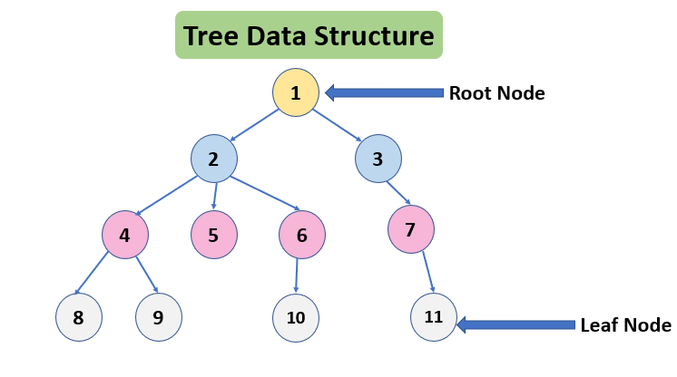

# Table of Content

- [introduction](#introduction)

- [requirements](#requirements) 
    - [math](#math)

    - [data structure algorithm](#dsa)

## Introduction

## Introduction

Tree adalah salah satu **struktur data non-linear** yang menjadi fondasi dari *Data Structure and Algorithm (DSA)*.  
Repository ini adalah perjalanan saya mempelajari Tree dari dasar hingga tingkat lanjut.  
Saya membagi proses belajar menjadi tiga metode utama:

- Mengenal fundamental dari Tree.
- Menyelesaikan problem *competitive programming* dari situs seperti [GeeksforGeeks](https://www.geeksforgeeks.org/), [LeetCode](https://leetcode.com/), dan platform lain.

- Membangun project berbasis **Tree**.

## Requirements

untuk belajar tree ada 2 requirement/prasyarat yang dibutuhkan yaitu matematika dan dsa,dari sisi matematika
dibutuhkan pemahaman matematika diskrit seperti `logic`,`graph`,`set theory` dan dari sisi dsa dibutuhkan
pemahaman mengenai array,queue,stack yang akan digunakan untuk membantu traversal dan menyimpan hasil operasi
tree,2 requirements itu akan dijelaskan lebih detail dibawah.

- ### math

Untuk memahami Tree, kamu perlu beberapa konsep dasar matematika — terutama dari Matematika Diskrit. Berikut adalah beberapa topik penting:

1.Logika(logic)

Digunakan untuk memahami ekspresi kondisional dan operasi boolean yang sering muncul pada algoritma tree traversal dan decision tree.

2.himpunan(set theory)

Berguna untuk memahami bagaimana elemen diorganisasi, termasuk konsep subset dan relasi antar elemen (parent–child, ancestor–descendant).

3.graph 

tree adalah salah satu bentuk lain dari `graph`,bedanya `tree` tidak memiliki `cycle` seperti graph pada umumnya.

#### Sumber Belajar Matematika Diskrit
- [Matematika Diskrit (STEKOM)](https://digilib.stekom.ac.id/assets/dokumen/ebook/feb_ffa40f116d4322d430e4d4ff287f156f5b2aff8c_1659617647.pdf)
- [Graph Theory (YSU)](http://lib.ysu.am/disciplines_bk/86ed8ab971105564c1b66357510f992a.pdf)

- ### dsa

tree membutuhkan data struktur dibawah untuk melakukan operasi traversal dan mengakses node

1. array

Digunakan untuk menyimpan node tree (misalnya dalam representasi heap atau segment tree)
2. Stack

Penting dalam tree traversal non-rekursif seperti inorder, preorder, atau postorder traversal. Stack meniru perilaku call stack rekursi.

3. queue

Dipakai dalam level order traversal (Breadth-First Search) untuk menjelajahi node secara berurutan dari atas ke bawah.Sumber yang dapat dipakai belajar.

#### Sumber Belajar DSA
- [Array](https://www.geeksforgeeks.org/dsa/array-data-structure-guide/)
- [Stack](https://www.geeksforgeeks.org/dsa/stack-data-structure/)
- [Build Stack from Scratch](https://github.com/Build-X-From-Scratch/Stack_Scratch)
- [Queue](https://www.geeksforgeeks.org/dsa/queue-data-structure/)
- [Build Queue from Scratch](https://github.com/Build-X-From-Scratch/Queue-Sratch)

## Why Learn Tree?

Tree banyak digunakan dalam:
- Struktur file system (directory tree).
- Database indexing (B-Tree, B+ Tree).
- Artificial Intelligence (Decision Tree).
- Compiler dan Expression Parsing.
- Optimasi algoritma pencarian (BST, Trie, Segment Tree).
